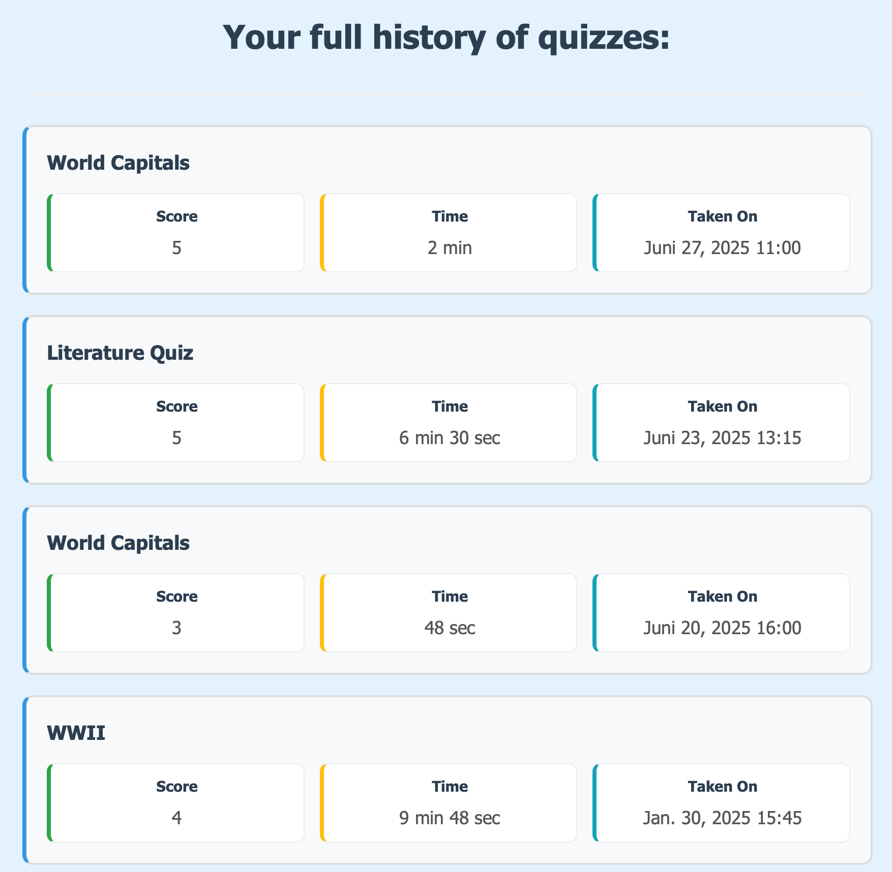

# Quiz Website

## 📋 Quiz Features

- **Randomized Questions**: Shuffles the order of questions for each attempt to prevent memorization.

- **Flexible Display Modes**:
  - **Single-Page Mode**: All questions are displayed on one page.
  - **Multiple-Page Mode**: One question is shown per page for focused answering.

- **Immediate Correction** *(Multiple-Page Mode only)*: Choose whether answers are checked after each question or at the end of the quiz.

- **Practice Mode**: Allows users to practice without being graded. If a user answers a question correctly three times in one session, that question is removed from the rotation.

- **Quiz Editing**: Enables quiz creators to update quiz details, questions, and answer options.

- **History**: Keeps track of user's attempts on a quiz.

- **Hotlinks** are provided _everywhere_

### 🗂️ Categories and Tags

- Each quiz belongs to a single **category**.
- Quizzes can have multiple **tags** to describe their content more specifically.
- Users can also create custom tags when adding quizzes.

### ⭐ Ratings and Reviews

- Users can leave a written **review** on any quiz to share feedback or thoughts.
- Quizzes can be **rated on a 0–5 star scale** to reflect overall quality and usefulness.

## Question Features

### 🧠 Question Types

- **Question-Response**: A standard text-based question where the user provides a text response.

- **Fill-in-the-Blank**: A blank can appear anywhere in the question text, and the user fills it in.

- **Multiple Choice**: The user selects one option from a list of possible answers.

- **Picture-Response**: An image is provided (optionally with accompanying text), and the user submits a text response based on it.

- **Multi-Answer**:
  - **Ordered**: Answers must be provided in a specific order.
  - **Unordered**: The order of the answers does not matter.

- **Multiple Choice with Multiple Answers**: The user can select more than one correct option.

- **Matching**: The user matches items from one column (left) to corresponding items in another column (right).

## 👤 User Features

- **Secure Authentication**: Passwords are hashed with salt for enhanced security.
- **Friend System**: Two-step friend request and approval process to manage friend connections.
- **Lookup**: One may find a user
- **Hotlinks** are provided _everywhere_

## 💬 Messaging Features

- **Friend Requests**: Send, accept, or decline friend requests.
- **Quiz Challenges**: Challenge friends to take a specific quiz.
- **Notes**: Send simple text notes to friends for communication.

## 🏆 Achievement Features

Unlock various achievements based on your quiz activity:

1. **First Step**: Complete your very first quiz.
2. **Quiz Addict**: Complete 10 quizzes.
3. **Flawless Victory**: Finish a quiz with all answers correct.
4. **Quiz Master**: Score 100% on 5 different quizzes.
5. **Speed Demon**: Complete a quiz in under 1 minute.

## 🛠️ Administration Features

Admins have access to advanced tools for managing the platform:

- **Create Announcements**: Post announcements visible to all users.
- **User Management**:
  - Remove users from the platform.
  - Promote regular users to administrators.
- **Quiz Management**:
  - Remove inappropriate or outdated quizzes.
  - Clear history data for a specific quiz.
- **View Site Statistics**: Monitor usage metrics such as total users and quizzes taken.

_If you are interested in implementation, comprehensive Javadoc documentation is available at `target/reports/apidocs`._

## Main Pages

> ⚠️ **Note**: The screenshots and descriptions provided are just snippets and do not represent full pages or all available features.

### 🧑‍💻 Basic User Page

Here is a preview of the basic user page

- **Lookup Users**: Search for other users and view basic profile information.
- **Friend Requests**: Accept or decline connection requests.
- **Quiz Challenges**: View, accept, or decline challenges from friends. Accepting a challenge redirects the user to the quiz.

The user dashboard offers quick access to key actions and information:

- **Most Popular Quizzes**: Displays most-attempted quizzes.
- **Recently Added Quizzes**: Shows the latest quizzes created on the platform.
- **Interactive Quiz Titles**: Clicking on a quiz title redirects the user to that quiz.
- **Friend Activity**:
  - View friends' quiz histories, sorted by creation or completion date.
- **User Activity**:
  - View your own quiz history, also sorted by creation or completion date.
- View and send **messages**

If you're an administrator, you can switch to **Administrator Mode** to access admin-only features and tools.

### 👤 Visiting a User's Page

When viewing another user's profile, you can:

- **Challenge** them to take a quiz.
- **Send a Message**

_(available only if you're friends)._

### 📜 User's Full Quiz History

The quiz history page provides a detailed record of all quizzes a user has completed:

- **Clickable Quiz Titles**: Each quiz name is a link that redirects to the quiz page.
- **Performance Overview**:
  - Displays the user's **score**
  - Shows **time taken** to complete each quiz
  - Includes the **date of completion**

### 🔍 Quiz Lookup

Users can easily find quizzes using search and sorting options:

- **Search By**:
  - **Name**
  - **Category**
  - **Tags**

- **Sort By**:
  - **Rating**
  - **Creation Date**
  - **Number of Participants**

### 📊 Quiz Overview

Each quiz includes a detailed overview page with the following information:

- **Your Attempts**:
  - View all your past attempts on this quiz.
  - Sort by **date**, **time taken**, or **percentage correct** — in ascending or descending order.

- **Top Performers**:
  - See the **top 3 performers**.
  - View the full leaderboard of all users who completed the quiz.

- **Top Scores by Time Range**:
  - Filter top performers based on time range:
    - Last 24 hours
    - Last week
    - Last month
    - Last year

### 📝 Taking a Quiz

- Timer is displayed throughout the quiz.

Quizzes can be taken in different correction modes:

---

#### 🕒 Final Correction Mode

- All questions are shown (on one or multiple pages).
- Answers are evaluated **after** completing the quiz.

The view on quiz results page after quiz completion:

---

#### ⚡ Immediate Correction Mode

- Questions appear one at a time.
- After answering, the user receives **immediate feedback**.

### 💬 Feedback and Challenges

After completing a quiz, you can:

- Leave a **comment** to share your thoughts.
- Rate the quiz on a **0–5 star scale**.
- **Send a challenge** to your friends to take the same quiz.

### ✏️ Create Question

Example: **Fill-in-the-Blank**

- Dynamically choose the position of the blank within the question.
- Add one or more correct answers dynamically.

Example: **Multi-Answer**

- Add new answers **below** or **at the end** of the list (especially important for ordered questions).
- Provide **alternative options** for each answer.

### ✏️ Edit Question

Example: **Fill-in-the-Blank**

- Save changes to the question text.
- Delete the entire question if needed.
- Save changes to answer options.
- Delete existing answer options.
- Add new answer options.

- The **Delete Option** button becomes disabled if only one option is left, ensuring that at least one answer option is always present until a new one is added.

### 💡 Little Insights

#### 🎯 Hovering Buttons

Interactive buttons provide visual feedback on hover:

#### 🚫 User Pic Not Found

Oops, could not find your picture:

#### 🏷️ Add Tags for a Quiz
The Best UI You’ll See Today!

#### 🏷️ Remove Tags from a Quiz
And more!

---

## 🙌 Final Notes

Thank you for checking out this Quiz Website project!

We hope you'll enjoy it!

Yours truly,  
**Team JA**

---

### 🚀 Ready for a quiz? Let’s go!